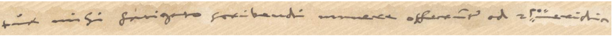
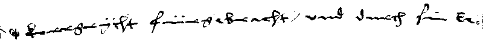

# 📜 SSDA 2023 – Historical Image Explorers

Welcome to the official repository of the **SSDA 2023 Challenge** by the **Historical Image Explorers team** from the **University of Fribourg, Switzerland**. This project explores advanced document image recognition methods tailored for **low-resource historical German manuscripts**.

---

## 📖 Project Overview

This repository is dedicated to researchers and developers working on **small-scale historical datasets**, especially those involving **Fraktur scripts** and degraded handwritten documents. The core objective is to empower the community with **lightweight yet effective models** that perform well on **noisy, aged, and low-data historical corpora**.

We focus on:
- Script-specific preprocessing (e.g., binarization for noise reduction)
- Contrastive experimentation with RGB vs. binary inputs
- Training strategies designed for **small-data regimes**

---

## 🔍 Visual Example

<p align="center">
  
</p>
<p align="center"><em>Figure 1: Sample historical German textline script from SSDA2023 dataset.</em></p>

<p align="center">
  
</p>
<p align="center"><em>Figure 2: Sample of binarized version of the textline, highlighting cleaner contours and improved contrast for recognition tasks.</em></p>

---

## ⚙️ Key Features

- 🧪 **Sample Code**  
  Hands-on Jupyter notebooks that showcase end-to-end pipelines for historical text recognition.

- 📦 **Specialized Mini Datasets**  
  Compact and curated datasets for efficient experimentation in low-resource settings.

- 🛠️ **Training Best Practices**  
  Guidance on working with limited data, including input transformation, augmentation, and model tuning tips.

---

## 📁 Repository Structure

- `Binary-TROCR.ipynb`  
  Fine-tuning example using binarized image inputs with the TrOCR architecture.

- `RGB-TROCR.ipynb`  
  A counterpart notebook for experiments using original RGB document images.

- `Binary_train_with_AUG.ipynb`  
  Demonstrates training on binarized inputs with basic augmentation for robustness.

- `pre-processing.zip`  
  Scripts for converting raw document scans into model-ready input formats (e.g., binarization, cropping).

- `README.txt`  
  Notes and technical remarks addressing challenges in training with constrained computational resources.

---

## 🚀 Getting Started

We welcome contributions from the broader community. Whether you're improving model accuracy, proposing new preprocessing steps, or contributing additional datasets, feel free to open an issue or submit a pull request.

To get started:

```bash
git clone https://github.com/your-repo/SSDA2023-Historical-Image-Explorers.git
cd SSDA2023-Historical-Image-Explorers
